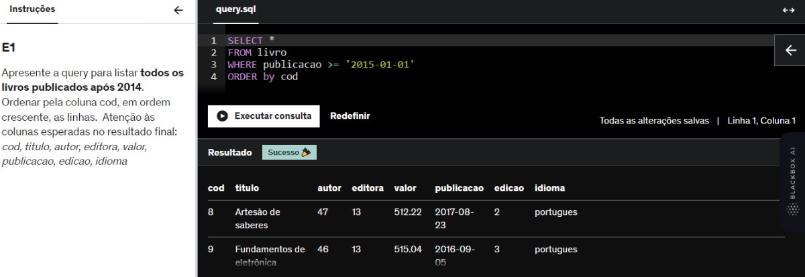

# E1
Apresente a query para listar todos os livros publicados após 2014. Ordenar pela coluna cod, em ordem crescente, as linhas.  Atenção às colunas esperadas no resultado final: cod, titulo, autor, editora, valor, publicacao, edicao, idioma

## *Resposta:*
SELECT * 
FROM livro 
WHERE publicacao >= '2015-01-01' 
ORDER by cod

