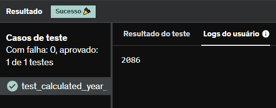

# E1
Desenvolva um código Python que lê do teclado nome e a idade atual de uma pessoa. Como saída, imprima o ano em que a pessoa completará 100 anos de idade.

## *Resposta:*
```
nome = input("Nome: ")
idade = int(input("Idade: "))
print((100 - idade) + 2023)
```

