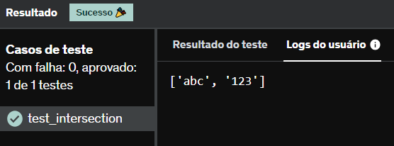

# E10
Escreva uma função que recebe uma lista e retorna uma nova lista sem elementos duplicados. Utilize a lista a seguir para testar sua função.

['abc', 'abc', 'abc', '123', 'abc', '123', '123']

## *Resposta:*
```
lista = ['abc', 'abc', 'abc', '123', 'abc', '123', '123']
novaLista = []

for i in lista:
    novaLista.append(i)
    
listaN = list(set(lista) & set(novaLista))
print(listaN)
```

