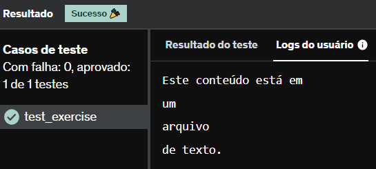

# E11
Escreva um programa que lê o conteúdo do arquivo texto arquivo_texto.txt e imprime o seu conteúdo.

## *Resposta:*
```
with open('arquivo_texto.txt','w') as arquivo:
    arquivo.write('Este conteúdo está em\num\narquivo\nde texto.')


arquivo = open('arquivo_texto.txt')
for linha in arquivo:
    print(linha, end="")
```

