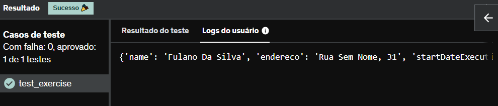

# E12
Leia o arquivo person.json, faça o parsing e imprima seu conteúdo.

## *Resposta:*
```
with open('person.json','w') as arquivo:
    arquivo.write("{'name': 'Fulano Da Silva', 'endereco': 'Rua Sem Nome, 31', 'startDateExecution': '2019-06-25 16:25:23.233', 'endDateExecution': '2019-06-25 16:25:23.331', 'siteId': 'BrasilDesktop', 'sitePage': '/', 'serverName': 'AS1332:10181', 'profileId': '8947071299', 'type': 'JSP_RENDERING', 'path': 'testado/com', 'performanceType': 'JSP_RENDERING'}")
    
arquivo = open('person.json')
print(arquivo.read())
```

