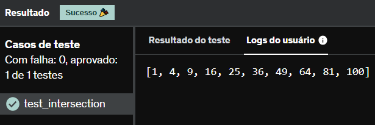

# E13
Implemente a função my_map(list, f) que recebe uma lista como primeiro argumento e uma função como segundo argumento. Esta função aplica a função recebida para cada elemento da lista recebida e retorna o resultado em uma nova lista.

Teste sua função com a lista de entrada [1, 2, 3, 4, 5, 6, 7, 8, 9, 10] e com uma função que potência de 2 para cada elemento.

## *Resposta:*
```
def my_map(list, f):
    list_nova = []
    for i in list:
        list_nova.append(i ** f)
    
    return list_nova

lista = [1, 2, 3, 4, 5, 6, 7, 8, 9, 10]
new_lista = my_map(lista, 2)
print(new_lista)
```

