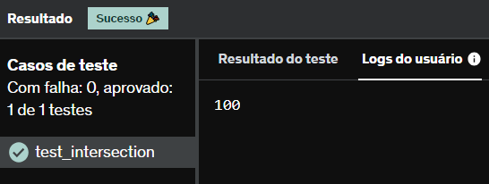

# E16
Escreva uma função que recebe uma string de números separados por vírgula e retorne a soma de todos eles. Depois imprima a soma dos valores.

A string deve ter valor  "1,3,4,6,10,76"

## *Resposta:*
```
def sum(valor = '0'):
    resultado = 0
    num = tuple(map(int, valor.split(',')))
    for i in num:
        resultado += i
    return print(resultado)

sum("1,3,4,6,10,76")
```

