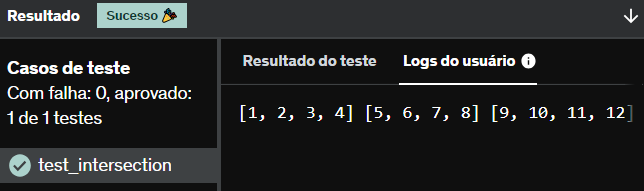

# E17
Escreva uma função que recebe como parâmetro uma lista e retorna 3 listas: a lista recebida dividida em 3 partes iguais. Teste sua implementação com a lista abaixo

lista = [1, 2, 3, 4, 5, 6, 7, 8, 9, 10, 11, 12]

## *Resposta:*
```
def fun(lista):
    lista_1 = []
    lista_2 = []
    lista_3 = []
    for i in range(len(lista)):
        if i <= 3:
            lista_1.append(lista[i])
        elif i <= 7:
            lista_2.append(lista[i])
        else:
            lista_3.append(lista[i])
    
    return lista_1, lista_2, lista_3

lista = [1, 2, 3, 4, 5, 6, 7, 8, 9, 10, 11, 12]
lista_1, lista_2, lista_3 = fun(lista)

print(lista_1, lista_2, lista_3)
```


