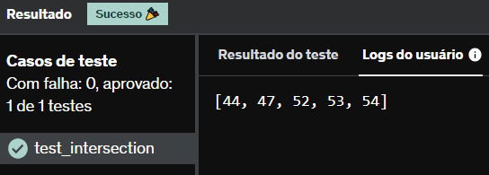

# E18
Dado o dicionário a seguir:

speed = {'jan':47, 'feb':52, 'march':47, 'April':44, 'May':52, 'June':53, 'july':54, 'Aug':44, 'Sept':54}

Crie uma lista com todos os valores (não as chaves!) e coloque numa lista de forma que não haja valores duplicados.

## *Resposta:*
```
speed = {'jan':47, 'feb':52, 'march':47, 'April':44, 'May':52, 'June':53, 'july':54, 'Aug':44, 'Sept':54}
lista = []
for i in speed.values():
    lista.append(i)
lista.sort()
print(list(set(speed.values()) & set(lista)))
```
