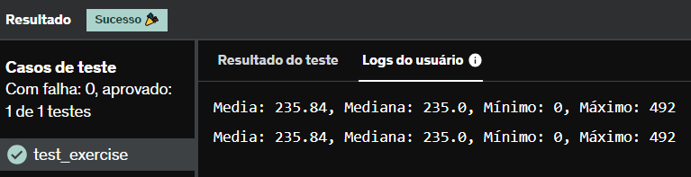

# E19
Calcule o valor mínimo, valor máximo, valor médio e a mediana da lista gerada na célula abaixo:

Obs.: Lembrem-se, para calcular a mediana a lista deve estar ordenada!

import random 
amostra aleatoriamente 50 números do intervalo 0...500
random_list = random.sample(range(500),50)

Use as variáveis abaixo para representar cada operação matemática

## *Resposta:*
```
import random

def sum(lista):
    resultado = 0
    for i in lista:
        resultado += i
    return resultado

random_list = random.sample(range(500), 50)
random_list.sort()

mediana = (float(random_list[24]) + float(random_list[25]))/2
media = sum(random_list)/len(random_list)
valor_minimo = random_list[0]
valor_maximo = random_list[49]
print(f"Media: {media}, Mediana: {mediana}, Mínimo: {valor_minimo}, Máximo: {valor_maximo}")
```

