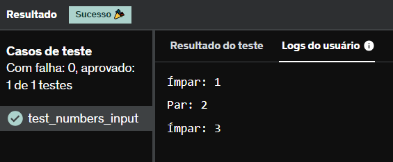

# E2
Escreva um código Python para verificar se três números digitados na entrada padrão são pares ou ímpares. Para cada número, imprima como saída Par: ou Ímpar: e o número correspondente(um linha para cada número lido).

Importante: Aplique a função range() em seu código.

## *Resposta:*
```
for num in range(3):
    num1 = int(input("Número: "))
    if num1 % 2 == 0:
        print("Par: " + str(num1))
    else:
        print("Ímpar: " + str(num1))
```

