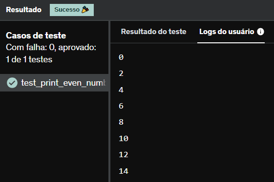

# E3
Escreva um código Python para imprimir os números pares de 0 até 20 (incluso).

Importante: Aplique a função range() em seu código.

## *Resposta:*
```
for num in range(21):
    if num % 2 == 0:
        print(num)
    else:
        continue
```

