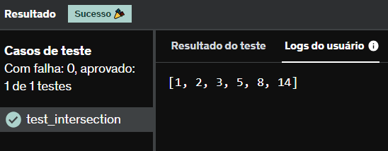

# E6
Considere as duas listas abaixo:

a = [1, 1, 2, 3, 5, 8, 14, 21, 34, 55, 89]
b = [1, 2, 3, 4, 5, 6, 7, 8, 9, 10, 11, 12, 13, 14, 15]

Escreva um programa para avaliar o que ambas as listas têm em comum (sem repetições), imprimindo a lista de valores da interseção na saída padrão.

## *Resposta:*
```
a = [1, 1, 2, 3, 5, 8, 14, 21, 34, 55, 89]
b = [1, 2, 3, 4, 5, 6, 7, 8, 9, 10, 11, 12, 13, 14, 15]

print(list(set(a) & set(b)))
```

