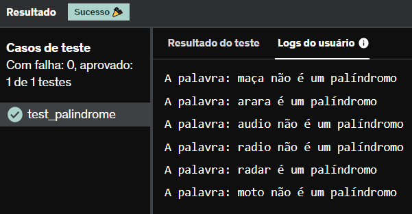

# E8
Verifique se cada uma das palavras da lista ['maça', 'arara', 'audio', 'radio', 'radar', 'moto'] é ou não um palíndromo.

Obs: Palíndromo é uma palavra que permanece igual se lida de traz pra frente.

## *Resposta:*
```
palavras = ['maça', 'arara', 'audio', 'radio', 'radar', 'moto']

for i in range(len(palavras)):
    if palavras[i] == palavras[i][::-1]:
        print('A palavra: ' + palavras[i] + ' é um palíndromo')
    else:
        print('A palavra: ' + palavras[i] + ' não é um palíndromo')
```

