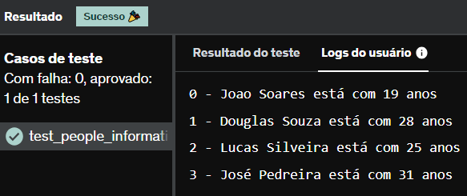

# E9
Dada as listas a seguir:

primeirosNomes = ['Joao', 'Douglas', 'Lucas', 'José']
sobreNomes = ['Soares', 'Souza', 'Silveira', 'Pedreira']
idades = [19, 28, 25, 31]

Faça um programa que imprima o dados na seguinte estrutura:
"índice - primeiroNome sobreNome está com idade anos".

## *Resposta:*
```
primeirosNomes = ['Joao', 'Douglas', 'Lucas', 'José']
sobreNomes = ['Soares', 'Souza', 'Silveira', 'Pedreira']
idades = [19, 28, 25, 31]

for i, pN in enumerate(primeirosNomes):
    print(str(i) + ' - ' + pN + ' ' + sobreNomes[i] + ' está com ' + str(idades[i]) + ' anos')
```

