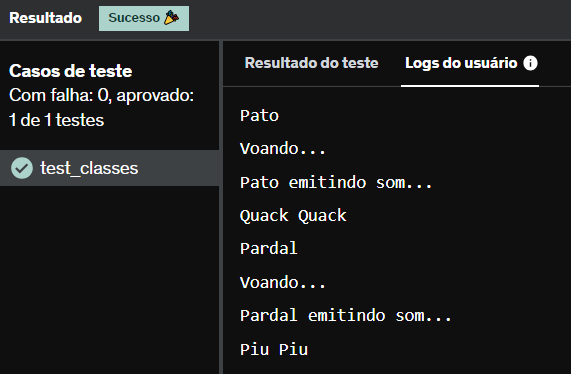

# E21
Implemente duas classes, Pato e Pardal , que herdam de uma superclasse chamada Passaro as habilidades de voar e emitir som.

Contudo, tanto Pato quanto Pardal devem emitir sons diferentes (de maneira escrita) no console, conforme o modelo a seguir.

## *Resposta:*
```
class Passaro:
    def __init__(self):
        self.voar = 'Voando...'
        self.emitir_som = 'emitindo som...'
        
class pato(Passaro):
    def __init__(self):
        super().__init__()
        self.Som = f'Pato {self.emitir_som}\nQuack Quack'
    
    def voa(self):
        return print(self.voar)
    
    def som(self):
        return print(self.Som)
    
class pardal(Passaro):
    def __init__(self):
        super().__init__()
        self.Som = f'Pardal {self.emitir_som}\nPiu Piu'
    
    def voa(self):
        return print(self.voar)
    
    def som(self):
        return print(self.Som)
    
print('Pato')
Pato = pato()
Pato.voa()
Pato.som()

print('Pardal')
Pardal = pardal()
Pardal.voa()
Pardal.som()
```

