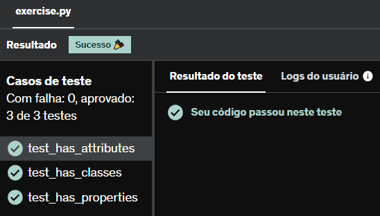

# E22
Crie uma classe chamada Pessoa, com um atributo privado chamado nome (declarado internamente na classe como __nome) e um atributo público de nome id.

Adicione dois métodos à classe, sendo um para definir o valor de __nome e outro para retornar o valor do respectivo atributo.

Lembre-se que o acesso ao atributo privado deve ocorrer somente através dos métodos definidos, nunca diretamente.  Você pode alcançar este comportamento através do recurso de properties do Python.

## *Resposta:*
```
class Pessoa:
    def __init__(self, id):
        self.__nome = ''
        self.id = id
        
    @property
    def nome(self):
        return self.__nome
        
    @nome.setter
    def nome(self, nome):
        self.__nome = nome
    
    
pessoa = Pessoa(0)
pessoa.nome = 'Fulano De Tal'
print(pessoa.nome)
```

