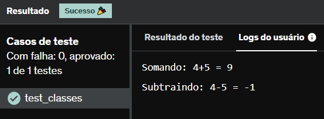

# E23
Crie uma classe  Calculo  que contenha um método que aceita dois parâmetros, X e Y, e retorne a soma dos dois. Nessa mesma classe, implemente um método de subtração, que aceita dois parâmetros, X e Y, e retorne a subtração dos dois (resultados negativos são permitidos).

## *Resposta:*
```
class Calculo:
    def __init__(self, x, y):
        self.x = x
        self.y = y
        
    def soma(self):
        return f'Somando: {self.x}+{self.y} = {self.x+self.y}'
    
    def sub(self):
        return f'Subtraindo: {self.x}-{self.y} = {self.x-self.y}'
    
c = Calculo(4,5)
print(c.soma())
print(c.sub())
```

