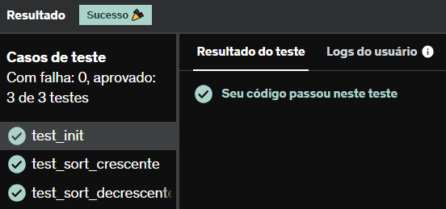

# E24
Crie uma classe Ordenadora que contenha um atributo listaBaguncada e que contenha os métodos ordenacaoCrescente e ordenacaoDecrescente.

Instancie um objeto chamado crescente dessa classe Ordenadora que tenha como listaBaguncada a lista [3,4,2,1,5] e instancie um outro objeto, decrescente dessa mesma classe com uma outra listaBaguncada sendo [9,7,6,8].

Para o primeiro objeto citado, use o método ordenacaoCrescente e para o segundo objeto, use o método ordenacaoDecrescente.

## *Resposta:*
```
class Ordenadora:
    def __init__(self,list):
        self.listaBaguncada = list
        
    def ordenacaoCrescente(self):
        lis = self.listaBaguncada
        lis.sort()
        self.listaBaguncada = lis
        return self.listaBaguncada
        
    def ordenacaoDecrescente(self):
        lis = self.listaBaguncada
        lis.sort(reverse = True)
        self.listaBaguncada = lis
        return self.listaBaguncada
    
    
crescente = Ordenadora([3,4,2,1,5])
decrescente = Ordenadora([9,7,6,8])
print(crescente.ordenacaoCrescente())
print(decrescente.ordenacaoDecrescente())
```

