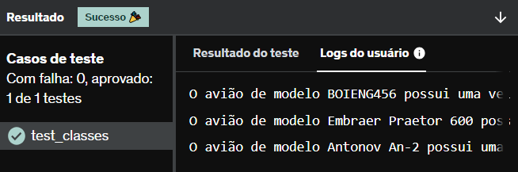

# E25
Crie uma classe Avião que possua os atributos modelo, velocidade_maxima, cor e capacidade.

Defina o atributo cor de sua classe , de maneira que todas as instâncias de sua classe avião sejam da cor “azul”.

Após isso, a partir de entradas abaixo, instancie e armazene em uma lista 3 objetos da classe Avião.

Ao final, itere pela lista imprimindo cada um dos objetos no seguinte formato:

“O avião de modelo “x” possui uma velocidade máxima de “y”, capacidade para “z” passageiros e é da cor “w”.

Sendo x, y, z e w cada um dos atributos da classe “Avião”.

## *Resposta:*
```
class Aviao:
    def __init__(self, modelo, velocidade_maxima, capacidade, cor = 'Azul'):
        self.modelo = modelo
        self.velocidade_maxima = velocidade_maxima
        self.cor = cor
        self.capacidade = capacidade
        

aviaoA = Aviao('BOIENG456',1500,400)
aviaoB = Aviao('Embraer Praetor 600',863,14)
aviaoC = Aviao('Antonov An-2', 258,12)

lista = [aviaoA,aviaoB,aviaoC]

for i in lista:
    print(f'O avião de modelo {i.modelo} possui uma velocidade máxima de {i.velocidade_maxima}, capaciade para {i.capacidade} passageiros e é da cor {i.cor}')
```

