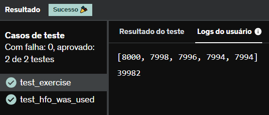

# E1
Você está recebendo um arquivo contendo 10.000 números inteiros, um em cada linha. Utilizando lambdas e high order functions, apresente os 5 maiores valores pares e a soma destes.

Você deverá aplicar as seguintes funções no exercício:

map
filter
sorted
sum

Seu código deverá exibir na saída (simplesmente utilizando 2 comandos `print()`):

a lista dos 5 maiores números pares em ordem decrescente;
a soma destes valores.

## *Resposta:*
```
def inteiros(numero):
    return int(numero)

with open('number.txt', 'r') as arq:
    dados = arq.read()
    lista = map(inteiros, dados.splitlines())
    
pares = list(filter(lambda x: x % 2 == 0, sorted(lista)))
print(list(reversed(pares[-5:])))
print(sum(pares[-5:]))
```
