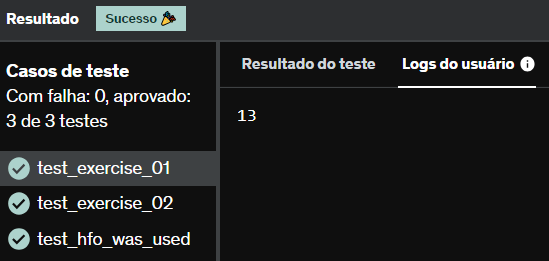

# E2
Utilizando high order functions, implemente o corpo da função conta_vogais. O parâmetro de entrada será uma string e o resultado deverá ser a contagem de vogais presentes em seu conteúdo.

É obrigatório aplicar as seguintes funções:

len
filter
lambda

Desconsidere os caracteres acentuados. Eles não serão utilizados nos testes do seu código.

## *Resposta:*
```
def conta_vogais(texto:str)-> int:
    cont = filter(lambda v: v == 'a' or v == 'e' or v == 'i' or v == 'o' or v == 'u', texto.lower())
    return len(list(cont))

palavra = conta_vogais('O Esporte Clube Bahia é o Mundo')

print(palavra)
```
