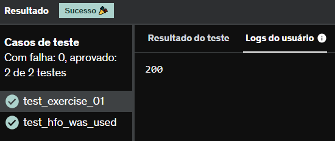

# E3
A função calcula_saldo recebe uma lista de tuplas, correspondendo a um conjunto de lançamentos bancários. Cada lançamento é composto pelo seu valor (sempre positivo) e pelo seu tipo (C - crédito ou D - débito). 

A partir dos lançamentos, a função deve calcular o valor final, somando créditos e subtraindo débitos.

Além de utilizar lambdas, você deverá aplicar, obrigatoriamente, as seguintes funções na resolução:

reduce (módulo functools), map

## *Resposta:*
```
from functools import reduce

def calcula_saldo(lancamentos) -> float:
    valor = lambda val, x: val + x[0] if x[1] == 'C' else val - x[0]
    x = map(lambda y: y[0], lancamentos)
    valor_total = reduce(valor, lancamentos , 0)
    return valor_total
    
lancamentos = [(10, 'D'), (300, 'C'), (20, 'C'), (80, 'D'), (30, 'D')]


resultado = calcula_saldo(lancamentos)
print(resultado)
```
