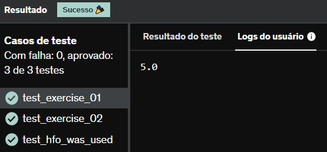

# E4
A função calcular_valor_maximo deve receber dois parâmetros, chamados de operadores e operandos. Em operadores, espera-se uma lista de caracteres que representam as operações matemáticas suportadas (+, -, /, *, %), as quais devem ser aplicadas à lista de operadores nas respectivas posições. Após aplicar cada operação ao respectivo par de operandos, a função deverá retornar o maior valor dentre eles.

Na resolução da atividade você deverá aplicar as seguintes funções:

max
zip
map

## *Resposta:*
```
def operacoes(a, b, operadores):
    if operadores == '+':
        return a + b
    elif operadores == '-':
        return a - b
    elif operadores == '*':
        return a * b
    elif operadores == '/':
        return a / b
    else: return a % b

def calcular_valor_maximo(operadores,operandos) -> float:
    operacao = list(zip(operadores, operandos))
    resultado = list(map(lambda x: operacoes(x[1][0], x[1][1], x[0]), operacao))
    return max(resultado)
    
operadores = ['-', '-', '*', '/', '%']
operandos  = [(3, 6), (-7, 4.9), (8, -8), (10, 2), (8, 4)]

x = calcular_valor_maximo(operadores, operandos)
print(x)
```
