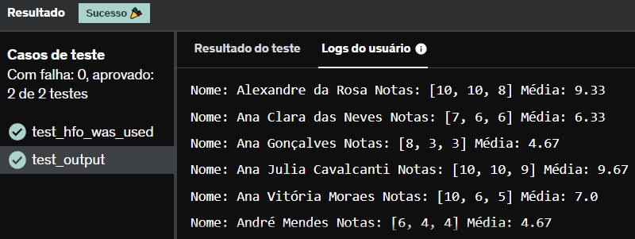

# E5
Um determinado sistema escolar exporta a grade de notas dos estudantes em formato CSV. Cada linha do arquivo corresponde ao nome do estudante, acompanhado de 5 notas de avaliação, no intervalo [0-10]. É o arquivo estudantes.csv de seu exercício.

Precisamos processar seu conteúdo, de modo a gerar como saída um relatório em formato textual contendo as seguintes informações:

Nome do estudante
Três maiores notas, em ordem decrescente
Média das três maiores notas, com duas casas decimais de precisão

O resultado do processamento deve ser escrito na saída padrão (print), ordenado pelo nome do estudante e obedecendo ao formato descrito a seguir:

Nome: <nome estudante> Notas: [n1, n2, n3] Média: <média>

Exemplo:

Nome: Maria Luiza Correia Notas: [7, 5, 5] Média: 5.67
Nome: Maria Mendes Notas: [7, 3, 3] Média: 4.33

Em seu desenvolvimento você deverá utilizar lambdas e as seguintes funções:

round
map
sorted

## *Resposta:*
```
def inteiros(numero):
    return int(numero)

aluno = {}
with open('estudantes.csv', 'r') as arq:
    dados = arq.read()
    for a in dados.splitlines():
        aluno[a.split(',')[0]] = sorted(list(map(inteiros, a.split(',')[1:])))[2:]

nA = sorted(aluno)
for i in nA:
    print(f'Nome: {i} Notas: {list(reversed(aluno[i]))} Média: {round(sum(aluno[i])/3, 2)}')
```
