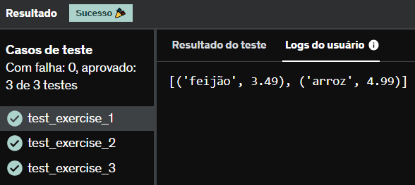

# E6
Você foi encarregado de desenvolver uma nova feature  para um sistema de gestão de supermercados. O analista responsável descreveu o requisito funcional da seguinte forma:

- Para realizar um cálculo de custo, o sistema deverá permitir filtrar um determinado conjunto de produtos, de modo que apenas aqueles cujo valor unitário for superior à média deverão estar presentes no resultado. Vejamos o exemplo:

Conjunto de produtos (entrada):

Arroz: 4.99

Feijão: 3.49

Macarrão: 2.99

Leite: 3.29

Pão: 1.99

Produtos com valor acima da média:

Arroz: 4.99

Feijão: 3.49

Observe que estamos definindo a assinatura de uma função como parte de sua resposta. Você não pode mudá-la, apenas codificar seu corpo. O parâmetro conteudo é um dicionário cuja chave contém o nome do produto e o valor, o respectivo preço (ponto flutuante).

Observe um exemplo de valor para conteudo:

{
    "arroz": 4.99,
    "feijão": 3.49,
    "macarrão": 2.99,
    "leite": 3.29,
    "pão": 1.99
}

O retorno da função obrigatoriamente deve ser uma lista. Cada elemento da lista é uma tupla em que a primeira posição contém o nome do produto e a segunda, o respectivo preço.

Importante: O retorno da função deve estar ordenado pelo preço do item (ordem crescente).

## *Resposta:*
```
def ordenando(n):  
    return n[1]

def sort(lista_tuplas):  
    return sorted(lista_tuplas, key = ordenando) 

def maiores_que_media(conteudo:dict)->list:
    valorM = sum(conteudo.values()) / len(conteudo)
    maior = []
    for i in conteudo.items():
        if i[1] > valorM:
            maior.append(i)
    return sort(maior)
    
    
conteudo = {
    "arroz": 4.99,
    "feijão": 3.49,
    "macarrão": 2.99,
    "leite": 3.29,
    "pão": 1.99
}

resultado = maiores_que_media(conteudo)
print(resultado)
```
