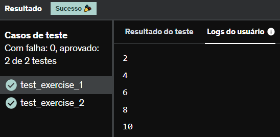

# E7
Generators são poderosos recursos da linguagem Python. Neste exercício, você deverá criar o corpo de uma função, cuja assinatura já consta em seu arquivo de início (def pares_ate(n:int):) .

O objetivo da função pares_ate é retornar um generator para os valores pares no intervalo [2,n] . Observe que n representa o valor do parâmetro informado na chamada da função.

## *Resposta:*
```
def pares_ate(n:int):
    for i in range(2, n+1):
        if i % 2 == 0:
            yield i
            
x = pares_ate(10)
try:
    while True:
        print(next(x))
    
except: pass
```
