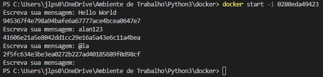

# Q3
Agora vamos exercitar a criação de um container que permita receber inputs durante sua execução. Seguem as instruções.

-- Criar novo script Python que implementa o algoritmo a seguir:

1 - Receber uma string via input

2 - Gerar o hash  da string por meio do algoritmo SHA-1

3 - Imprimir o hash em tela, utilizando o método hexdigest

4 - Retornar ao passo 1

-- Criar uma imagem Docker chamada mascarar-dados que execute o script Python criado anteriormente

--  Iniciar um container a partir da imagem, enviando algumas palavras para mascaramento

-- Registrar o conteúdo do script Python, arquivo Dockerfile e comando de inicialização do container neste espaço.

## *Resposta:*

**Script Python:**
```
import hashlib

while True:
    try:
        mensagem = input("Escreva sua mensagem: ")
        mensagemCodif = mensagem.encode()
        mensagemCrip = hashlib.sha1(mensagemCodif)
        print(mensagemCrip.hexdigest())
    except:
        break
```

**Arquivo Dockerfile:**
```
FROM python:3

WORKDIR /app

COPY mascarar-dados.py .

CMD ["python", "mascarar-dados.py"]
```

**Comando de inicialização do container:**

