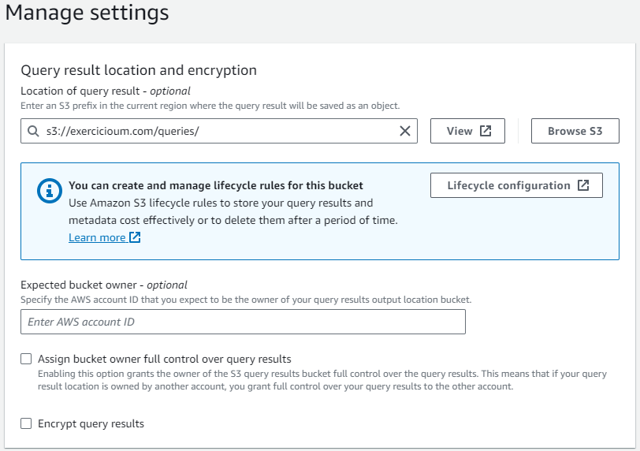
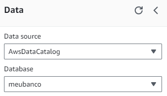
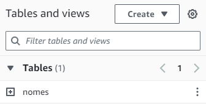

# Lab AWS Athena

## Configurando Athena


## Criando um Banco de Dados
Usando o comando ```CREATE DATABASE meubanco``` irá criar um banco de dados denominado "meubanco".


## Criando uma Tabela
Executando o comando abaixo, criará uma tabela no banco de dados denominada "nomes".
```
CREATE EXTERNAL TABLE IF NOT EXISTS meubanco.nomes (
    nome string,
    sexo string,
    total int,
    ano int
)
ROW FORMAT SERDE 'org.apache.hadoop.hive.serde2.lazy.LazySimpleSerDe'
WITH SERDEPROPERTIES (
    'serialization.format' = ',',
    'field.delim' = ','
)
LOCATION 's3://exercicioum.com/dados/nome.csv/';
```
