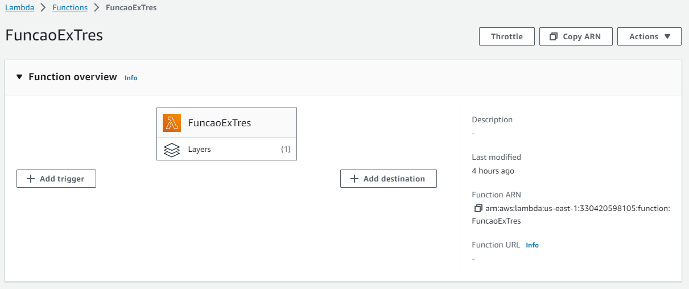
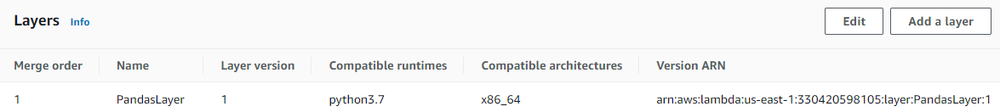
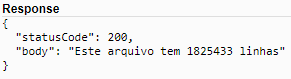

# Lab AWS Lambda

## Criando a função do Lambda
Nome da função: "FuncaoExTres"


## Construindo o código
```
import json
import pandas
import boto3
 
 
def lambda_handler(event, context):
    s3_client = boto3.client('s3')
 
    bucket_name = 'exercicioum.com'
    s3_file_name = 'dados/nomes.csv'
    objeto = s3_client.get_object(Bucket=bucket_name, Key=s3_file_name)
    df=pandas.read_csv(objeto['Body'], sep=',')
    rows = len(df.axes[0])
 
    return {
        'statusCode': 200,
        'body': f"Este arquivo tem {rows} linhas"
    }
```

## Criando uma Layer


## Utilizando a Layer
