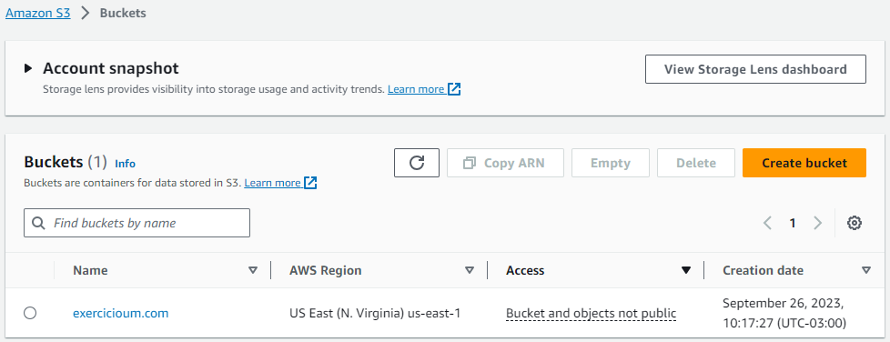
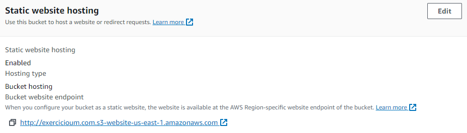
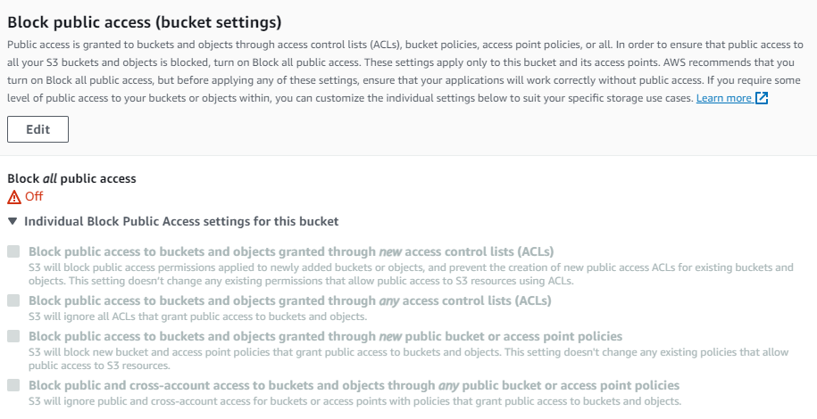
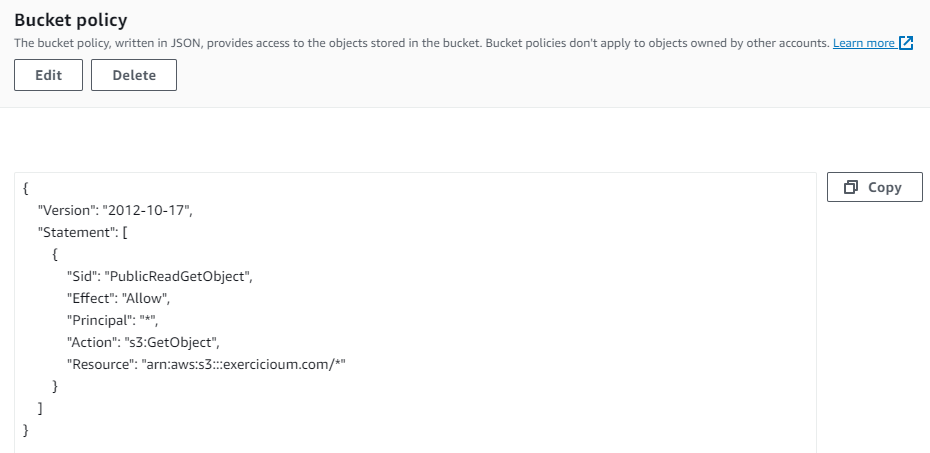
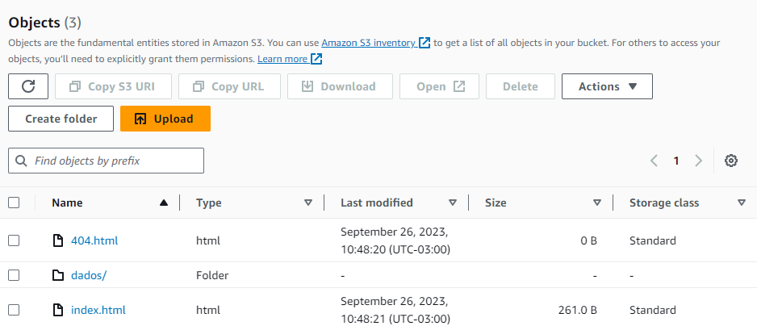
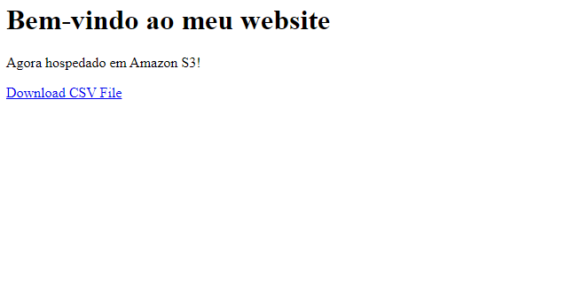

# Lab AWS S3
Fazer com que um bucket do Amazon S3 funcione como hospedagem de conteúdo estático.

## Criação de um Bucket:
Nome do bucket: exercicioum.com


## Habilitando hospedagem de site estático:



## Editando as configurações do Bloqueio de acesso público:



## Adicionando política de bucket que torna o conteúdo do bucket publicamente disponível:



## Configurando um documento de índice e um documento de erros:
Index.html:
```
<html xmlns="http://www.w3.org/1999/xhtml" >
<head>
    <title>Home Page do meu WebSite - Tutorial de S3</title>
</head>
<body>
  <h1>Bem-vindo ao meu website</h1>
  <p>Agora hospedado em Amazon S3!</p>
  <a href="dados/nomes.csv">Download CSV File</a> 
</body>
</html>
```



## Testando o Endpoint do site:

