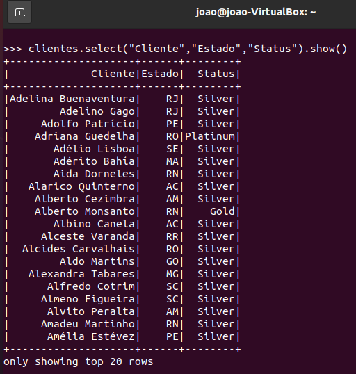
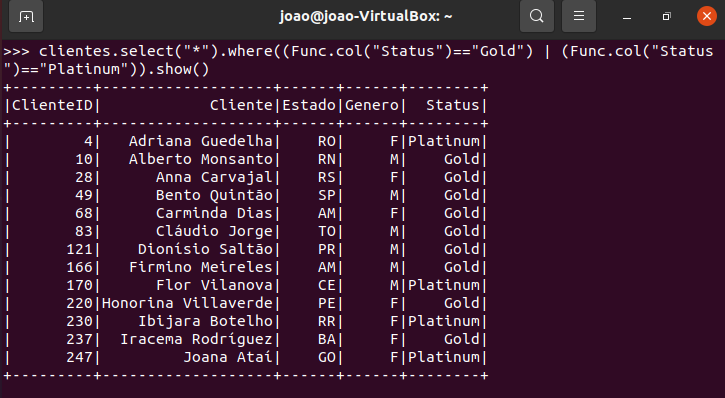
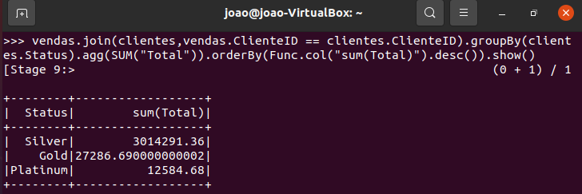
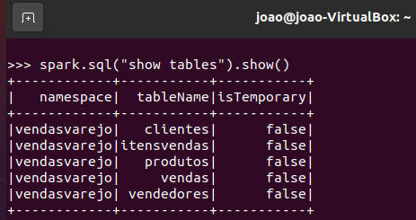
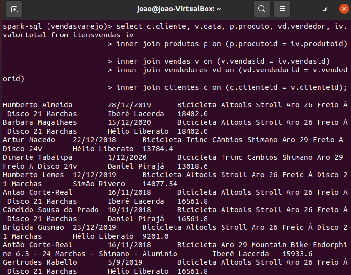

# Relatório

## Learn By Example: Hadoop, MapReduce for Big Data problems
O **Hadoop** é uma plataforma de software em Java de computação distribuída voltada para clusters e processamento de grandes volumes de dados, ele é um framework de código aberto que permite o armazenamento e processamento distribuídos de grandes conjuntos de dados. Tendo como características:

- Tolerância a falhas e recuperação automática.
- Portabilidade entre hardware e sistemas iguais.
- Escalabilidade para armazenar grande volume de dados.
- Confiabilidade, através de diversas cópias de dados.

O **MapReduce** é uma estrutura de execução distribuída baseada em Java que faz parte do ecossistema Apache Hadoop,  que usa algoritmos de computação distribuída e paralela. O MapReduce possui duas fases de processamento, sendo a primeira a fase de mapeamento (Map), que é responsável pelo processamento primário dos dados de entrada. Indo então para a segunda, em que os dados da primeira fase são enviados para a função de redução (Reduce) como entradas.

## Formação Spark com Pyspark
O **Spark** é um mecanismo de análise unificado para processamento de dados em grande escala com módulos integrados para SQL, streaming, machine learning e processamento de gráficos. Spark provê uma interface para programação de clusters com paralelismo e tolerância a falhas.

O conjunto de dados resilientes e distribuídos ou **RDD** (Resilient Distributed Datasets) é o conceito central do framework Spark, ele é definido como uma coleção de elementos que é tolerante a falhas e que é capaz de operar em paralelo. **Dataset** é uma interface adicionada no Spark que oferece os benefícios dos RDDs (*tipagem forte*, *capacidade de usar funções lambda poderosas*) com os benefícios do mecanismo de execução otimizado do Spark SQL, Python não tem suporte para a API Dataset, mas devido à natureza dinâmica do Python, muitos dos benefícios da API Dataset já estão disponíveis. Um **DataFrame** é um conjunto de dados organizado em colunas nomeadas, é conceitualmente equivalente a uma tabela em um banco de dados relacional ou a um quadro de dados em Python, mas com melhor otimização.
### Faça você mesmo:
Crie uma consulta que mostre, nesta ordem, Nome, Estados e Status

Crie uma consulta que mostre apenas os clientes do Status “platinum” e “gold”

Demostre quanto cada Status de Clientes representa em vendas?

**Spark SQL** é um módulo Spark para processamento estruturado de dados. Ao contrário da API básica do Spark RDD, as interfaces fornecidas pelo Spark SQL fornecem ao Spark mais informações sobre a estrutura dos dados e da computação que está sendo executada.
### Faça você mesmo:
Crie um banco de dados no DW do Spark chamado VendasVarejo, e persista todas as tabelas neste banco de dados.

Crie uma consulta que mostre de cada item vendido: Nome do Cliente, Data da Venda, Produto, Vendedor e Valor Total do item.

O **Machine Learning** usa algoritmos para entender o modelo que dá origem a um conjunto de dados para conseguir prever ou classificar novos valores. **MLlib** é a biblioteca escalonável de *aprendizado de máquina* do Apache Spark, ela se encaixa nas APIs do Spark e interopera com NumPy em Python, podendo usar qualquer fonte de dados do Hadoop, facilitando a conexão aos fluxos de trabalho do Hadoop.