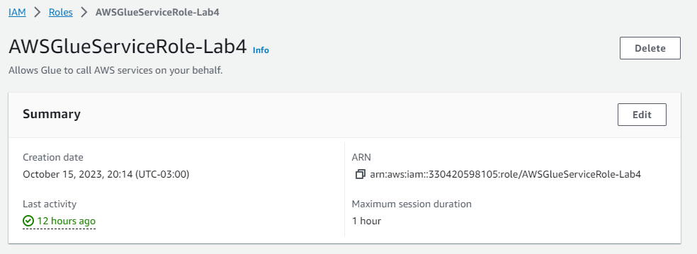
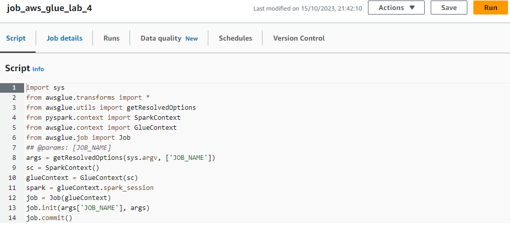
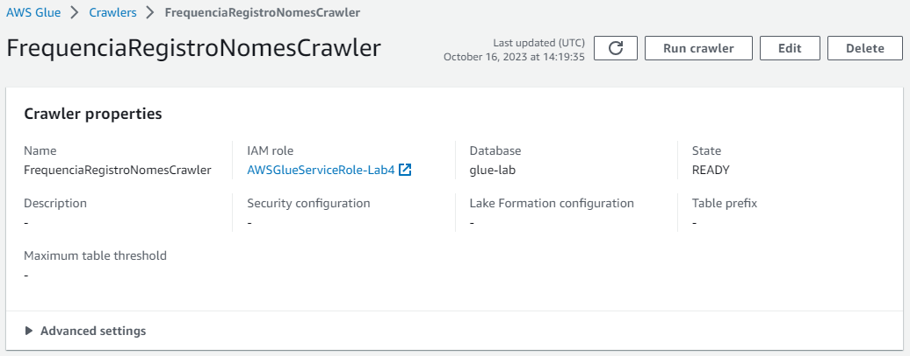

# Laboratório de AWS Glue
Para nosso laboratório, o arquivo deverá estar em um bucket do S3. Vamos considerar que o path do arquivo seja s3://{BUCKET}/lab-glue/input/nomes.csv . Lembre-se que o valor {BUCKET} deve ser substituído por um dos disponíveis em sua conta.

`s3://joaoluiz/lab-glue/input/nomes.csv`

 

## Criando a IAM Role para os jobs do AWS Glue.

Com as seguintes políticas de permissões:
- `AmazonS3FullAccess`
- `AWSGlueConsoleFullAccess`
- `AWSLakeFormationDataAdmin`
- `CloudWatchFullAccess`

 

## Configurando as permissões no AWS Lake Formation

Com permissões: `Alter`, `Create table`, `Describe` e `Drop`.

 

## Criando novo job no AWS Glue
Para realizar o processamento do arquivo nomes.csv iremos criar um job através do serviço AWS Glue.

Propriedades:
- Nome: `job_aws_glue_lab_4`
- IAM Role: `AWSGlueServiceRole-Lab4`
- Type: `Spark`
- Glue version: `Glue 3`
- Language: `Python 3`
- Worker Type: `G 1x`
- Requested number of workers: `2`
- Number of retries: `0`
- Job timeout (minutes): `5`

Parâmetros do Job:
- --S3_INPUT_PATH: `s3://joaoluiz/lab-glue/input/nomes.csv`
- --S3_TARGET_PATH: `s3://joaoluiz/pasta2/`

 

## Criando novo crawler
Crawlers são mecanismos que podemos utilizar para monitorar nosso armazenamento de dados de modo a criar/atualizar metadados no catálogo do Glue de forma automática. Na sequência iremos desenvolver um crawler para automaticamente criar uma tabela chamada frequencia_registro_nomes_eua a partir dos dados escritos no S3 (verifique a última atividade do notebook).

