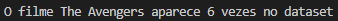

# Tarefa 1: Python com Pandas e Numpy
Leia o arquivo actors.csv e codifique os cálculos solicitados sobre o conjunto de dados utilizando a biblioteca Pandas. Adicione apenas a resposta da questões nos espaços indicados. Seu código-fonte deverá estar no Github.

## Questão 1
Identifique o ator/atriz com maior número de filmes e o respectivo número de filmes.

**Código:**
```
import pandas as pd

atores = pd.read_csv("actors.csv")
MaiorNumFilmes = atores.loc[atores['Number of Movies'].idxmax(), ["Actor", "Number of Movies"]]

print(f"O ator/atriz com maior número de filmes é {MaiorNumFilmes['Actor']} com {MaiorNumFilmes['Number of Movies']} filmes")
```

**Resultado:**


## Questão 2
Apresente a média da coluna contendo o número de filmes.

**Código:**
```
import pandas as pd

atores = pd.read_csv("actors.csv")
media = atores['Number of Movies'].sum() / atores['Number of Movies'].count()

print(f"A média do número de filmes é {media}")
```

**Resultado:**


## Questão 3
Apresente o nome do ator/atriz com a maior média por filme.

**Código:**
```
import pandas as pd

atores = pd.read_csv("actors.csv")
MaiorMediaFilme = atores.loc[atores['Average per Movie'].idxmax(), ["Actor", "Average per Movie"]]

print(f"O ator/atriz com maior média por filme é {MaiorMediaFilme['Actor']}, com  uma média de {MaiorMediaFilme['Average per Movie']}")
```

**Resultado:**


## Questão 4
Apresente o nome do ator/atriz com a maior média por filme.

**Código:**
```
import pandas as pd

atores = pd.read_csv("actors.csv")
nomeFilmes = atores.pivot_table(index = ['#1 Movie'], aggfunc='size').idxmax()
nFilmes = atores.pivot_table(index = ['#1 Movie'], aggfunc='size').max()

print(f"O filme {nomeFilmes} aparece {nFilmes} vezes no dataset")
```

**Resultado:**

