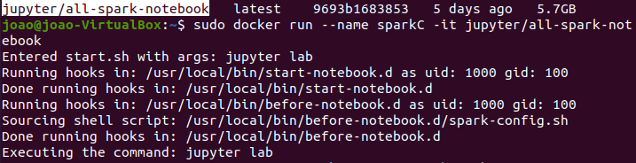

# Tarefa 2: Apache Spark - Contador de Palavras
Neste atividade você irá desenvolver um job de processamento com o framework Spark por meio de um container Docker. Lembre-se que seu código-fonte deverá estar no GitHub para posterior avaliação do monitor(a) da Sprint.

## Questão 1
Nesta atividade faremos uso da imagem jupyter/all-spark-notebook (https://registry.hub.docker.com/r/jupyter/all-spark-notebook) para criar um container e utilizar o recurso de shell oferecido pelo Spark.




## Questão 2
Usando o Spark Shell, apresente a sequência de comandos Spark necessários para contar a quantidade de ocorrências de cada palavra contida no arquivo README.md de seu repositório git.

```
from pyspark import SparkContext, SparkConf

conf = SparkConf().setAppName("ContadorPalavra")
sc = SparkContext.getOrCreate()
arq = sc.textFile("README.md")

linhasVazias = arq.filter(lambda x: len(x) > 0)
palavra = linhasVazias.flatMap(lambda x: x.split(' '))

contPalavra = palavra.map(lambda x: (x,1)) \
    .reduceByKey(lambda x, y: x + y) \
    .map(lambda x: (x[1], x[0])).sortByKey(False)

for palavra in contPalavra.collect():
    print(palavra)
```