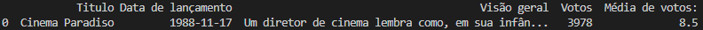

# Tarefa 1: Exercício TMDB

### Etapa 1 -  Criando sua conta no TMDB
Será preciso criar uma conta no porta do TMDB para, após, solicitar as chaves de acesso para uso da API.

Chave da API: `c04c067e745c2758ff20569a71b454ef`

### Etapa 2 - Testando rapidamente as credenciais e a biblioteca

Uma vez que você tenha sua chave de API, você pode fazer solicitações à API usando a seguinte estrutura de URL:

`https://api.themoviedb.org/3/{endpoint}?api_key={sua_chave_de_api}&{parâmetros_opcionais}`

Onde {endpoint} é o recurso que você deseja acessar (por exemplo, movie/{movie_id} para obter detalhes de um filme específico) e {parâmetros_opcionais} são quaisquer parâmetros adicionais que você deseje incluir na solicitação (por exemplo, language=pt-BR para obter informações em português).

Código Python:
```
import requests
import pandas as pd

from IPython.display import display


api_key = "**************************"

url = f"https://api.themoviedb.org/3/movie/top_rated?api_key={api_key}&language=pt-BR"

response = requests.get(url)
data = response.json()

filmes = []

for movie in data['results']:
    df = {'Titulo': movie['title'],
    'Data de lançamento': movie['release_date'],
    'Visão geral': movie['overview'],
    'Votos': movie['vote_count'],
    'Média de votos:': movie['vote_average']}

filmes.append(df)

df = pd.DataFrame(filmes)
display(df)
```

Resultado:

