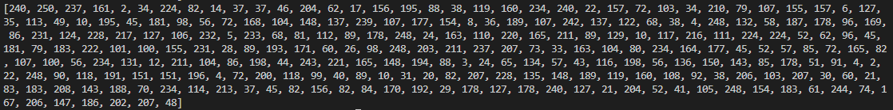
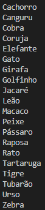
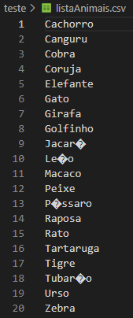
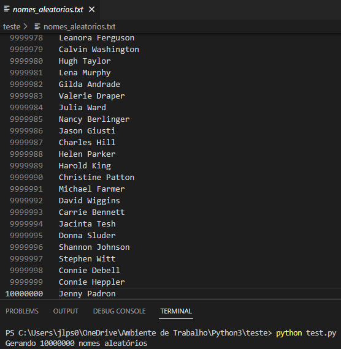

# Tarefa 3: Exercícios - Geração de massa de dados
Lembre-se que as tarefas são pré-requisitos para a execução do laboratório de Apache Spark na sequência. Não esperamos que você registre resposta neste espaço. Contudo, deves adicionar o código-fonte produzido ao seu repositório no Github para posterior avaliação pelo monitor(a).

## Questão 1
[Warm up] Em Python, declare e inicialize uma lista contendo 250 inteiros obtidos de forma aleatória. Após, aplicar o método reverse sobre o conteúdo da lista e imprimir o resultado.

### Código:

```
import random

lista = []
while(True):
    lista.append(random.randint(0, 250))
    
    if(len(lista) == 250):
        break

lista.reverse()
print(lista)
```

### Resposta:




## Questão 2
[Warm up] Em Python, declare e inicialize uma lista contendo o nome de 20 animais. Ordene-os em ordem crescente e itere sobre os itens, imprimindo um a um (você pode utilizar list comprehension aqui).  Na sequência, armazene o conteúdo da lista em um arquivo de texto, um item em cada linha, no formato CSV.

### Código:

```
listaAnimais = ["Cachorro", "Gato", "Elefante", "Leão", "Tigre", "Urso", "Pássaro", "Peixe", "Golfinho", "Canguru", "Rato", "Zebra", "Girafa", "Macaco", "Cobra", "Jacaré", "Tartaruga", "Coruja", "Raposa", "Tubarão"]

listaAnimais.sort()
    
with open('listaAnimais.csv', 'w') as Q2:
    for animal in listaAnimais:
        print(animal)
        Q2.write(f'{animal}\n')
```

### Resposta:





## Questão 3
[Laboratório] Elaborar um código Python para gerar um dataset de nomes de pessoas. Siga os passos a seguir para realizar a atividade:

- Passo 1:  Instalar biblioteca names para geração de nomes aleatórios. O comando de instalação é pip install names

- Passo 2 Importar as bibliotecas random, time, os e names em seu código

- Passo 3: Definir os parâmetros para geração do dataset, ou seja, a quantidades de nomes aleatórios e a quantidade de nomes que devem ser únicos.
```
# Define a semente de aleatoriedade

random.seed(40)

qtd_nomes_unicos = 3000

qtd_nomes_aleatorios = 10000000
```

Nota: Quando trabalhamos com números randômicos em computação, na realidade, estamos falando de valores pseudoaleatórios, uma vez que o computador não consegue gerar números verdadeiramente aleatórios. No caso do Python, a função random.seed inicializa o algoritmo responsável pela geração de valores randômicos. É um processo determinístico,  pois os valores gerados serão sempre os mesmos se utilizado a mesma configuração de inicialização. A este número inicial chamamos de semente de aleatoriedade.

- Passo 4: Gerar os nomes aleatórios.
```
aux=[]

for i in range(0, qtd_nomes_unicos):

    aux.append(names.get_full_name())

print("Gerando {} nomes aleatórios".format(qtd_nomes_aleatorios))

dados=[]

for i in range(0,qtd_nomes_aleatorios):

    dados.append(random.choice(aux))
```

- Passo 5: Gerar um arquivo de texto contendo todos os nomes, um a cada linha. O nome do arquivo deve ser nomes_aleatorios.txt

- Passo 6: Abrir o arquivo e verificar seu conteúdo (editor de texto)


### Código:

```
import random
import time
import os
import names

# Define a semente de aleatoriedade

random.seed(40)

qtd_nomes_unicos = 3000
qtd_nomes_aleatorios = 10000000
aux=[]
dados=[]

for i in range(0, qtd_nomes_unicos):
    aux.append(names.get_full_name())

print("Gerando {} nomes aleatórios".format(qtd_nomes_aleatorios))

for i in range(0,qtd_nomes_aleatorios):
    dados.append(random.choice(aux))
    
with open('nomes_aleatorios.txt', 'w') as Q3:
    for nomes in dados:
        Q3.write(f'{nomes}\n')
```

### Resposta:

