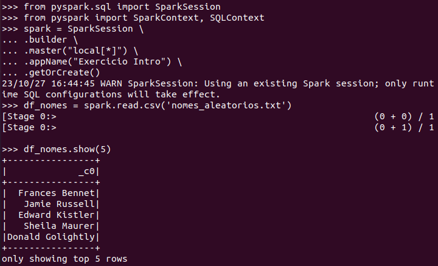
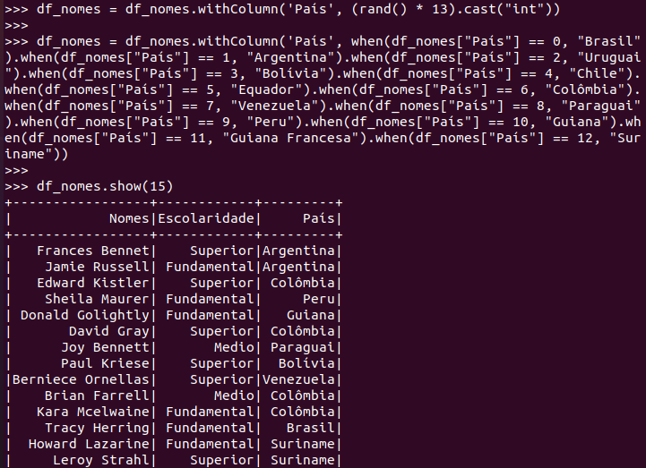
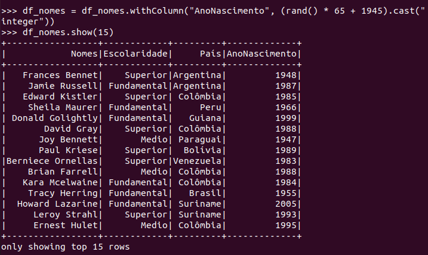
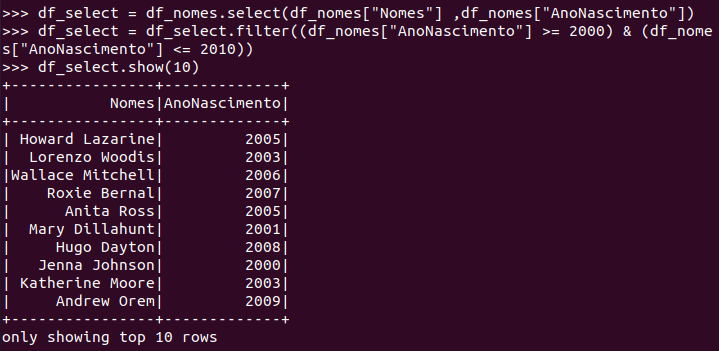
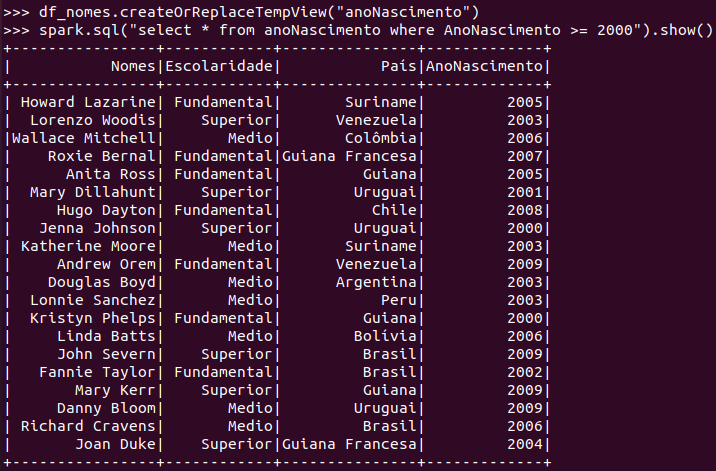
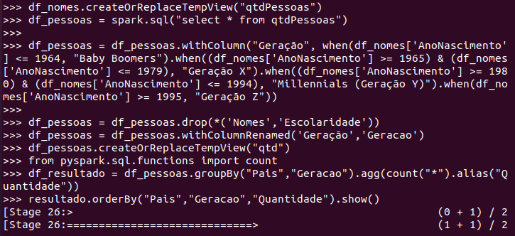

# Tarefa 4: Exercícios - Apache Spark
Neste laboratório usaremos um arquivo CSV para criar um Dataframe e testar comandos SQL. Iremos utilizar o arquivo nomes_aleatorios.txt gerado na tarefa anterior. Esse arquivo tem aproximadamente 10 milhões de nomes distintos e apresenta os nomes mais populares registrados em cada ano.

## Questão 1:
Inicialmente iremos preparar o ambiente, definindo o diretório onde nosso código será desenvolvido. Para este diretório iremos copiar o arquivo nomes_aleatorios.txt.

Após, em nosso script Python, devemos importar as bibliotecas necessárias:

`from pyspark.sql import SparkSession`

`from pyspark import SparkContext, SQLContext`

Aplicando as bibliotecas do Spark, podemos definir a Spark Session e sobre ela definir o Context para habilitar o módulo SQL
```
spark = SparkSession \
                .builder \
                .master("local[*]")\
                .appName("Exercicio Intro") \
                .getOrCreate()
```

Nesta etapa, adicione código para ler o arquivo nomes_aleatorios.txt através do comando spark.read.csv. Carregue-o para dentro de um dataframe chamado df_nomes e, por fim, liste algumas linhas através do método show. Exemplo: `df_nomes.show(5)`

### Resposta:


## Questão 2:
No Python, é possível acessar uma coluna de um objeto dataframe pelo atributo (por exemplo df_nomes.nome) ou por índice (df_nomes['nome']). Enquanto a primeira forma é conveniente para a exploração de dados interativos, você deve usar o formato de índice, pois caso algum nome de coluna não esteja de acordo seu código irá falhar.

Como não informamos no momento da leitura do arquivo, o Spark não identificou o Schema por padrão e definiu todas as colunas como string. Para ver o Schema, use o método df_nomes.printSchema().

Nesta etapa, será necessário adicionar código para renomear a coluna para Nomes, imprimir o esquema e mostrar 10 linhas do dataframe.

### Resposta:


## Questão 3:
Ao dataframe (df_nomes), adicione nova coluna chamada Escolaridade e atribua para cada linha um dos três valores de forma aleatória: Fundamental, Medio ou Superior.

Para esta etapa, evite usar funções de iteração, como por exemplo: for, while, entre outras. Dê preferência aos métodos oferecidos para próprio Spark.

### Resposta:


## Questão 4:
Ao dataframe (df_nomes), adicione nova coluna chamada Pais e atribua para cada linha o nome de um dos 13 países da América do Sul, de forma aleatória.

Para esta etapa, evite usar funções de iteração, como por exemplo: for, while, entre outras. Dê preferência aos métodos oferecidos para próprio Spark.

### Resposta:


## Questão 5:
Ao dataframe (df_nomes), adicione nova coluna chamada AnoNascimento e atribua para cada linha um valor de ano entre 1945 e 2010, de forma aleatória. 

Para esta etapa, evite usar funções de iteração, como por exemplo: for, while, entre outras. Dê preferência aos métodos oferecidos para próprio Spark.

### Resposta:


## Questão 6:
Usando o método select do dataframe (df_nomes), selecione as pessoas que nasceram neste século. Armazene o resultado em outro dataframe chamado df_select e mostre 10 nomes deste.

### Resposta:


## Questão 7:
Usando Spark SQL repita o processo da Pergunta 6. Lembre-se que, para trabalharmos com SparkSQL, precisamos registrar uma tabela temporária e depois executar o comando SQL. Abaixo um exemplo de como executar comandos SQL com SparkSQL:

`df_nomes.createOrReplaceTempView ("pessoas")`

`spark.sql("select * from pessoas").show()`

### Resposta:


## Questão 8:
Usando o método select do Dataframe df_nomes, Conte o número de pessoas que são da geração Millennials (nascidos entre 1980 e 1994) no Dataset

### Resposta:


## Questão 9:
Repita o processo da Pergunta 8 utilizando Spark SQL

### Resposta:


## Questão 10:
Usando Spark SQL, obtenha a quantidade de pessoas de cada país para uma das gerações abaixo. Armazene o resultado em um novo dataframe e depois mostre todas as linhas em ordem crescente de Pais, Geração e Quantidade

- Baby Boomers – nascidos entre 1944 e 1964;
- Geração X – nascidos entre 1965 e 1979;4
- Millennials (Geração Y) – nascidos entre 1980 e 1994;
- Geração Z – nascidos entre 1995 e 2015.

### Resposta:


