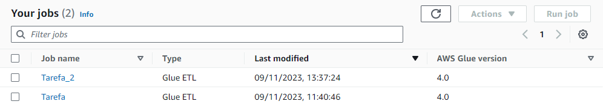

# Tarefa 3: Desafio Parte 3 - Processamento da Trusted
Iremos separar o processamento em dois jobs: o primeiro, para carga histórica, será responsável pelo processamento dos arquivos CSV  e o segundo, para carga de dados do TMDB (e outra API, se utilizada). Lembre-se que suas origens serão os dados existentes na RAW Zone.

Todos os dados serão persistidos na Trusted no formato PARQUET, particionados por data de coleta do TMDB (dt=<ano-mês-dia> exemplo: dt=2023-11-31). A exceção fica para os dados oriundos do processamento batch (CSV), que não precisam ser particionados.

### Código do Job 1:
```
import sys
from awsglue.transforms import *
from awsglue.utils import getResolvedOptions
from pyspark.context import SparkContext
from awsglue.context import GlueContext
from awsglue.job import Job

## @params: [JOB_NAME]
args = getResolvedOptions(sys.argv, ['JOB_NAME', 'S3_INPUT_PATH', 'S3_TARGET_PATH'])

sc = SparkContext()
glueContext = GlueContext(sc)
spark = glueContext.spark_session
job = Job(glueContext)
job.init(args['JOB_NAME'], args)

source_file = args['S3_INPUT_PATH']
target_path = args['S3_TARGET_PATH']

df = glueContext.create_dynamic_frame.from_options(
    "s3",
    {
        "paths": [
            source_file
        ]
    },
    "csv",
    {"withHeader": True, "separator":"|"},
)

fileParquet = df

glueContext.write_dynamic_frame.from_options(
    frame = fileParquet,
    connection_type = "s3",
    connection_options = {"path": target_path},
    format = "parquet")

job.commit()
```

### Código do Job 2:
```
import sys
from awsglue.transforms import *
from awsglue.utils import getResolvedOptions
from pyspark.context import SparkContext
from awsglue.context import GlueContext
from awsglue.job import Job

## @params: [JOB_NAME]
args = getResolvedOptions(sys.argv, ['JOB_NAME', 'S3_INPUT_PATH','S3_TARGET_PATH'])

sc = SparkContext()
glueContext = GlueContext(sc)
spark = glueContext.spark_session
job = Job(glueContext)
job.init(args['JOB_NAME'], args)

source_file = args['S3_INPUT_PATH']
target_path = args['S3_TARGET_PATH']

df = glueContext.create_dynamic_frame.from_options(
    "s3",
    {
        "paths": [
            source_file
        ]
    },
    "json",
)

dynamic_frame = df.repartition(100)

glueContext.write_dynamic_frame.from_options(
    frame = dynamic_frame,
    connection_type = "s3",
    connection_options = {"path": target_path},
    format = "parquet")

job.commit()
```

### Imagem dos Jobs criados:
