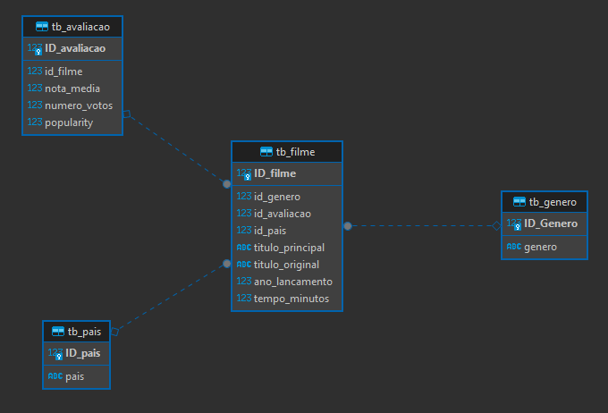

# Tarefa 4: Desafio Parte 3 - Modelagem de dados da Refined
Nesta etapa do desafio, você deve fazer a modelagem de dados da camada refined, definindo as tabelas e, se necessário, views, a fim de disponibilizar os dados para a ferramenta de visualização (QuickSight, a partir da próxima Sprint). Lembre-se que a origem será os dados oriundos da Trusted Zone.

### Modelagem de Dados:
