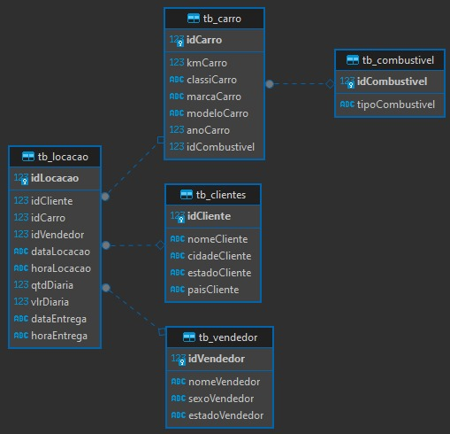

# Tarefa 1 - Modelagem Relacional - Normalização
Aqui você irá praticar conceitos de Modelagem relacional que estudou anteriormente. Estaremos considerando a base de dados Concessionaria, cujo modelo é apresentado na Modelagem Lógica abaixo.

O desafio é normalizar esta base de dados, ou seja, aplicar as formas normais.

### Desenho da Modelagem Lógica:
